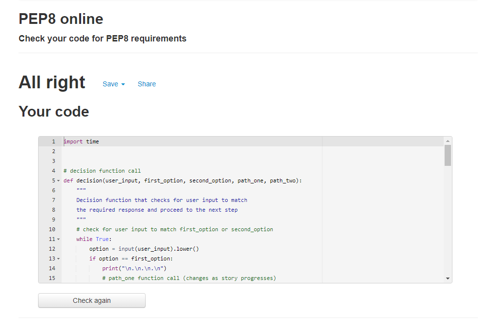

# Save The Bees 

Link to live project [here](https://save-the-bees-game.herokuapp.com/)

# Table of contents

1. [About](#about)
2. [Main Requirements](#main-requirements)
3. [UX (User Experience)](#ux-user-experience)
    1. [Ideal User](#ideal-user)
    2. [User Stories](#user-stories)
4. [Development Planes](#development-planes)
    1. [Strategy](#strategy)
    2. [Skeleton](#skeleton)
5. [Features](#features)
    1. [Existing Features](#existing-features)
    2. [Back to the Feature (Features for the Future)](#back-to-the-feature-features-for-the-future)
6. [Issues](#issues)
7. [Technologies Used](#technologies-used)
     1. [Main Languages Used](#main-languages-used)
     2. [Libraries, Programs, and Resources](#libraries-programs-and-resources)
8. [Testing](#testing)
     1. [Manual Testing](#manual-testing)
     2. [Code Validation](#code-validation)
9. [Deployment](#deployment)
10. [Credits](#credits)
11. [Acknowledgements](#acknowledgements)

# About

The "Save the Bees" project idea was inspired from the love my daughters have towards the bumblebees.
The purpose of the game is to engage the user and request valid input in order to progress through the story. Depending on the decisions that the user has to make the story might lead to a "game over" scenario or "you saved the bees" scenario.
This is the third of five Portfolio Projects that must be completed in order to obtain the Diploma in Software Development (E-commerce Applications) from Code Institute. 

# Main Requirements

Main requirements for the Project Portfolio 3:
 - Implement a given algorithm as a computer program
 - Adapt and combine algorithms to solve a given problem
 - Adequately use standard programming constructs: repetition, selection, functions, composition, modules, aggregated data (arrays, lists, etc.)
 - Explain what a given program does
 - Identify and repair coding errors in a program
 - Use library software for building a graphical user interface, or command-line interface, or web application, or mathematical software
 - Implement a data model, application features and business logic to manage, query and manipulate data to meet given needs in a particular real-world domain.
 - Demonstrate and document the development process through a version control system such as GitHub
 - Deploy a command-line application to a cloud-based platform

[Back to top ⇧](#save-the-bees)

# UX (User Experience)

## Ideal User
  
The ideal user of the game would be anyone that enjoys a choose your own adventure stories in a smaller version. There is no age specification

## User Stories

 - I want to run the program anytime
 - I want to make different decisions and follow different paths
 - I want to receive feedback for my inputs (valid or not)
 - I want to be greeted with a welcome message
 - I want to see a game over message
 - I want to see a you won message
 - I want to be able to play again

# Development Planes

## Strategy
Identifying the target audience:
 - Fans of choose your own adventure stories
 - Fans of terminal based games
 - Bee admirers
 - Environmentalists

The application needs to allow the **user** to:
- Have a great gaming experience
- Provide fun facts about bees
- Provide different decisions and scenarios
- Provide feedback for the user inputs

## Skeleton
In order to have a clear guide to develop the project, a flowchart was created with [Lucidchart](https://www.lucidchart.com/pages/examples/flowchart_software).

You can find the flowchart [here](https://lucid.app/lucidchart/invitations/accept/inv_d7dbd85c-771b-496b-b8d5-d717d9082fa6)

You will need to create a free account in order to access the flowchart

[Back to top ⇧](#save-the-bees)

# Features

## Existing Features
1. Run Save The Bees Button
   - At the top left corner of the terminal, there is a red button which allows the user to run the program from the start whenever they want to.
   - Hover over effect and pointer

2. Terminal
   - The terminal section allows the user to start the application, by following directions and input their decisions

## Back to the Feature (Features for the Future)
 - Create more scenarios
 - Change positioning of terminal and button
 - Implement a timer

# Issues

 - No present issues.
 - Code is fully functional with no bugs

# Technologies Used

## Main Languages Used
1. [Python](https://en.wikipedia.org/wiki/Python_(programming_language))
2. [HTML5](https://en.wikipedia.org/wiki/HTML5)
3. [CSS3](https://en.wikipedia.org/wiki/CSS)

## Libraries, Programs, and Resources

1. [Lucidchart](https://www.lucidchart.com/pages/examples/flowchart_software): creation of flowchart. 
2. [Git](https://git-scm.com/): version control through the GitPod terminal (commit to Git and push to GitHub)
2. [GitHub](https://github.com/): repository to store the project
3. [Heroku](https://id.heroku.com/login): deployment of the program
4. [Pep8](http://pep8online.com/): test and validatation of the code.

[Back to top ⇧](#save-the-bees)

# Testing

## Manual Testing 
User Stories:
 - I want to run the program anytime:
   Program runs in browsers: Chrome, Firefox, Edge

 - I want to make different decisions and follow different paths

 

 scenario one choice of "get up" and "turn off the lights"

 

 scenario two: choise of "get up" and "don't turn off the lights"

 - I want to receive feedback for my inputs (valid or not)

 

 - I want to be greeted with a welcome message
 
 
 
 - I want to see a game over message

  
 
 - I want to see a you won message

  
 
 - I want to be able to play again

  

## Code Validation

[PEP8 Online Validation](http://pep8online.com/) was used to validate the code

  

  run python code

  
  
  helpers python code

  [Back to top ⇧](#save-the-bees)

# Deployment

This project was committed to Git and push to GitHub using the workspace terminal.
To deploy this program to Heroku, the developer followed these steps:

1. Log into [Heroku](https://id.heroku.com/login)
2. Create new app
3. Name the app
4. Choose the region
5. Select Settings from menu
6. Go to Buildpacks
7. Add buildpack: Python, node.js in that order
8. Deploy option from menu
9. Deployment method > select to GitHub 
10. Authorize GitHub to connect
11. Search and link the GitHub repository
12. Manual deploy
13. Deploy branch
14. Finished Installation > 'App was successfully deployed'

# Credits

Content:
 - The fun facts about bees were found [here](https://supersimple.com/article/10-fun-facts-about-bees/)
 - All other content is original, created by the developer

# Acknowledgements

- I would like to thank my wife, children, family, and friends for their support and valued critic during the project development
- I would like to thank my mentor, Seun, for her guidance throughout the process

[Back to top ⇧](#save-the-bees)